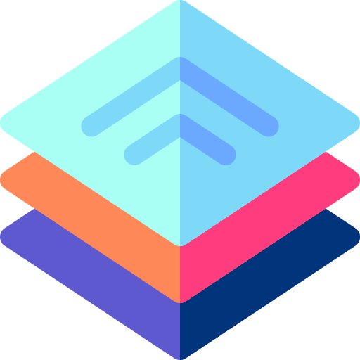
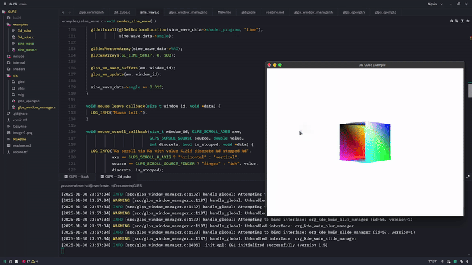

  
  <h1>GLIMPSE: Platform System (GLPS)</h1>

🚀 **Glimpse (GLPS)** is a cross-platform **windowing and platform system** with a strong focus on **Wayland backend development**. Designed for **flexibility**, **performance**, and **developer sanity** (we try our best, at least).

---

## 🌍 Why GLPS?

Ever wanted a **lightweight, modern** alternative to GLFW that doesn’t force you to wrestle with legacy code? GLPS is here to provide **low-level control** without sacrificing usability. Whether you're managing windows, handling input devices, or integrating graphics, **GLPS has you covered**.

---

## 📌 Current Status

GLPS is actively evolving! Here’s a snapshot of what’s already implemented and what’s in the pipeline:

---

### ✅ **Feature Matrix (Wayland & Win32)**

| **Category**             | **Feature**           | **Wayland Status** | **Win32 Status** | **Details**                                                              |
| ------------------------ | --------------------- | ------------------ | ---------------- | ------------------------------------------------------------------------ |
| **Window Management**    | Multi-Window Support  | ✅ Implemented     | ✅ Implemented   | Unique contexts per window                                               |
|                          | High DPI Scaling      | ⬜ Planned         | ⬜ Planned       | Resolution adaptive interfaces                                           |
| **Graphics Integration** | EGL Support           | ✅ Implemented     | N/A              | Display, context, and surface management (Wayland only)                  |
|                          | WGL Support           | N/A                | ✅ Implemented   | Display, context, and surface management (Win32 only)                    |
|                          | OpenGL Contexts       | ✅ Implemented     | ✅ Implemented   | GLPS handles context creation; you handle the rendering                  |
|                          | Vulkan Support        | ⬜ Planned         | ⬜ Planned       | Additional backend support                                               |
| **Input Handling**       | Keyboard Input        | ✅ Implemented     | ✅ Implemented   | keyboard events                                                          |
|                          | Mouse Input           | ✅ Implemented     | ✅ Implemented   | Pointer event management                                                 |
|                          | Touchscreen Support   | ✅ Implemented     | ⬜ Planned       | Touch input events                                                       |
| **Advanced Features**    | Wayland Compositor    | ✅ Implemented     | N/A              | Registry interactions (Wayland only)                                     |
|                          | XDG-Shell Support     | ✅ Implemented     | N/A              | Surface and toplevel management (Wayland only)                           |
|                          | Clipboard Integration | ✅ Implemented     | ✅ Implemented     | Cross-application data transfer                                          |
|                          | Drag-and-Drop         | ✅ Implemented     | ✅ Implemented   | Enhanced user interaction                                                |
| **Development Tools**    | Logging               | ✅ Implemented     | ✅ Implemented   | Integrated with [Pico Logger](https://github.com/YASSINE-AA/Pico-Logger) |

---

## 🔮 Upcoming Development Priorities

1️⃣ **Multi-Monitor Support** – Because one screen is never enough.
2️⃣ **Cross-Platform Compatibility** – Bringing the magic to more platforms.
3️⃣ **Expanded Input Method Support** – Because not everyone uses a keyboard and mouse.

---

## 🛠️ Logging & Debugging

GLPS is **fully integrated** with [Pico Logger](https://github.com/YASSINE-AA/Pico-Logger), ensuring **structured, real-time** debugging without the chaos of scattered `printf`s.

---

## 🤝 Contributing

Got ideas? Bugs? An existential crisis about windowing systems? **Join the GLPS project!** Check out our contribution guidelines and roadmap for ways to help.

---

## 📜 License

GLPS is licensed under the **MIT License**, meaning you’re free to use, modify, and distribute it—just don’t blame us if your GPU catches fire. 🔥

---
