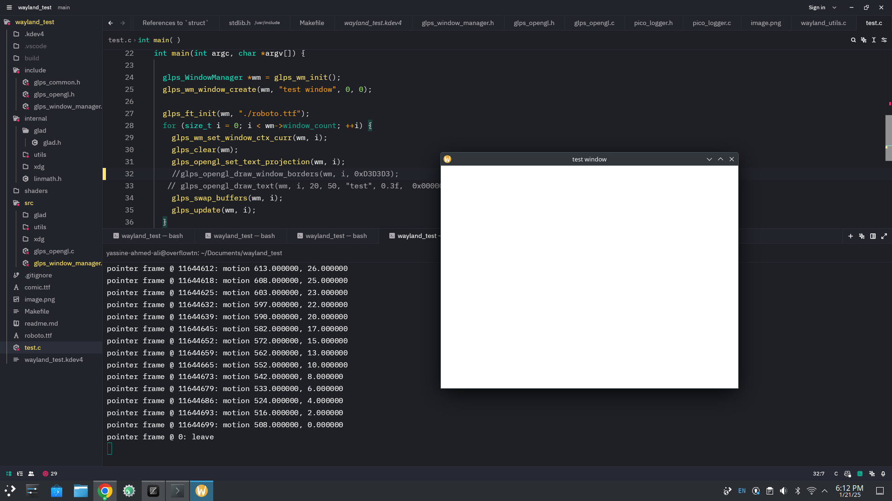

# GLIMPSE: Graphics Library & Platform System (GLPS)

Glimpse is a cross-platform graphics library with a current focus on Wayland backend development.

## Overview

GLPS aims to provide a robust, flexible graphics rendering framework with comprehensive platform support.

## Current Status

### Feature Matrix

| Category | Feature | Status | Details |
|----------|---------|--------|---------|
| **Platform Support** | Wayland Backend | ✅ Implemented | Core Wayland protocol functionality |
| | Multi-Platform Planning | ⬜ Roadmap | Future cross-platform expansion |
| **Window Management** | Multi-Window Support | ✅ Implemented | Unique contexts per window |
| | High DPI Scaling | ⬜ Planned | Resolution adaptive interfaces |
| **Graphics Integration** | EGL Support | ✅ Implemented | Display, context, surface management |
| | OpenGL Rendering | ✅ Implemented | Full rendering pipeline |
| | Vulkan Rendering | ⬜ Planned | Additional rendering support |
| **Input Handling** | Keyboard Input | ✅ Implemented | Wayland keyboard events |
| | Mouse Input | ✅ Implemented | Pointer event management |
| | Touchscreen Support | ✅ Implemented | Touch input events |
| **Advanced Features** | Wayland Compositor | ✅ Implemented | Registry interactions |
| | XDG-Shell Support | ✅ Implemented | Surface and toplevel management |
| | Clipboard Integration | ✅ Implemented | Cross-application data transfer |
| | Drag-and-Drop |  ✅ Implemented | Enhanced user interaction |
| **Development Tools** | Logging | ✅ Implemented | [Pico Logger](https://github.com/YASSINE-AA/Pico-Logger) integration |

## Upcoming Development Priorities

1. Implement multi-monitor support
2. Enhance cross-platform compatibility
3. Expand input method support

## Logging

Integrated with [Pico Logger](https://github.com/YASSINE-AA/Pico-Logger) for robust debugging and event tracking.

## Contribution

Interested in contributing? Check our guidelines and project roadmap.

## License

MIT License.
